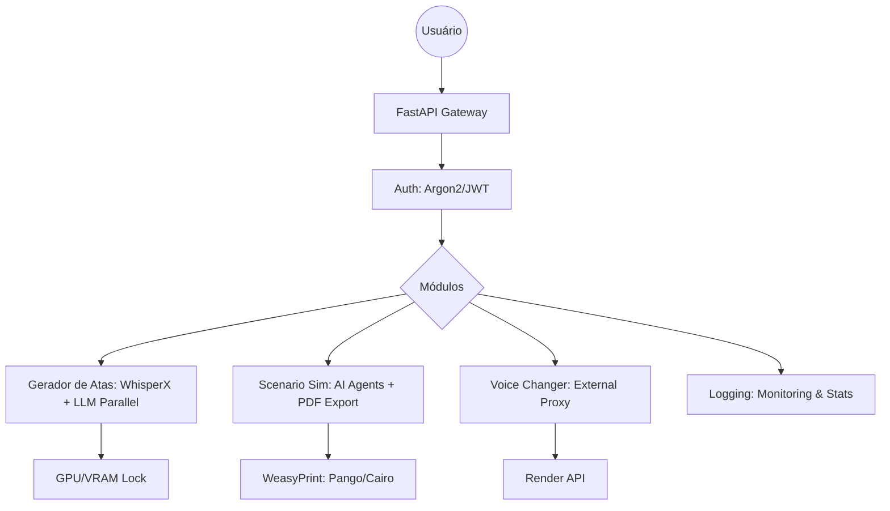

# Brain Hub API (Proof of Concept – Scenario Sim) 🧠

> [!CAUTION]
> **LEITURA OBRIGATÓRIA ANTES DE CLONAR:**
> Este repositório segue padrões rigorosos de **Gitflow**, **Conventional Commits** e **Versionamento Semântico**. Todo desenvolvedor deve ler o guia de [Padronização de Versões e Workflow](README.md) antes de iniciar qualquer contribuição. Não serão aceitos Pull Requests que não sigam estas diretrizes.

O **Brain Hub API** é um back-end robusto e modular construído em **FastAPI**, servindo como infraestrutura central para provas de conceito (PoCs) e sistemas focados em Inteligência Artificial, transcrição acelerada por GPU e pipelines orquestrados de Agentes LLM.

## 🏗️ Fluxo de Dados Global

O Brain Hub API atua como um orquestrador central que distribui tarefas entre modelos locais (GPU/CPU) e APIs externas.



---

## 🌟 Principais Módulos da Aplicação

### 1. Gerador de Atas Autônomo (`gerador_atas`)
Este módulo não apenas transcreve áudios com alta precisão, mas orquestra um enxame de agentes LLMs paralelos para formular a documentação executiva (DOCX) instantaneamente.
* **WhisperX com Coleta de Lixo Ativa:** Carregamento singleton com `Semaphore(1)` e limpeza explícita de VRAM (`gc.collect`) para evitar erros de CUDA em placas de 4GB a 8GB.
* **Master Flow Paralelo:** Processamento simultâneo de Introdução, Tópicos e Deliberações via `asyncio.gather`.

### 2. Scenario Simulator (`scenario_sim`)
Motor de orquestração de Agentes AI para simulação de cenários complexos de negócio.
* **Arquitetura de Agentes:** Utiliza `openai-agents` para gerir o ciclo de vida: `Scene -> Actor/Material -> Simulation`.
* **Exportação Profissional:** Converte os outputs dos agentes (HTML/CSS) em documentos PDF de alta fidelidade usando o motor `WeasyPrint`.

### 3. Voice Changer (`voice_changer`)
Serviço de tratamento e mutação acústica.
* **Proxy de Alta Performance:** Consome uma API externa dedicada para processamento de voz, isentando o servidor local de carregar modelos acústicos pesados na VRAM.

### 4. Auth & Security (`auth`)
Gerenciamento de identidades e proteção de rotas.
* **Segurança de Vanguarda:** Hashing **Argon2** (resistente a ataques de força bruta via GPU) e sistema de sessão Stateless via **JWT**.

---

## 🛠 Tech Stack

- **Framework Web:** FastAPI + Uvicorn
- **Banco de Dados:** SQLAlchemy (ORM) + Alembic (Migrations)
- **Engine LLM:** OpenAI API + LangChain Core + Ollama API (fallback configurável)
- **Processamento Acústico/CUDA:** Torch, Numpy, OpenAI-Whisper, WhisperX
- **Segurança:** Python-Jose (JWT), Passlib
- **Docs:** WeasyPrint + Python DOCX nativos

---

## 🚀 Como Executar Localmente

### 1. Pré-Requisitos

- **Python 3.12+**
- (Opcional, mas exigido para transcrições e processamentos locais espessos) **Placa de Vídeo NVIDIA** (CUDA 11.8+ / 12.0+)

> [!IMPORTANT]
> **Atenção (Diarização):** Para que a separação de vozes (Speaker Diarization) funcione, você **PRECISA** aceitar os termos de uso dos seguintes modelos no Hugging Face com sua conta logada, e depois gerar um `HF_KEY` (Read Token):
>
> 1. [pyannote/speaker-diarization-3.1](https://huggingface.co/pyannote/speaker-diarization-3.1)
> 2. [pyannote/segmentation-3.0](https://huggingface.co/pyannote/segmentation-3.0)

### 2. Instalação e Ambiente Virtual

Para isolar as dependências apropriadamente de forma limpa, inicialize o ambiente através do **Conda**:

```bash
conda create -n qa python==3.11.14
conda activate qa
cd poc-scenario-sim
pip install -r requirements.txt
```

### 3. Variáveis de Ambiente

Crie um arquivo `.env` na raiz do projeto puxando do `.env.example`:

```bash
# Definindo as chaves (OpenAI e Hugging Face)
OPENAI_KEY="sk-..."
HF_KEY="hf_..."

# Configurando o fallback da Engine das LLMs
# 'auto': Tenta OpenAI para paralelismo veloz com Prompt Caching, e recua pro Ollama se falhar
# 'local': Força o uso do Ollama e desabilita requests pra web
BACKEND_MODE="auto" 
```
### Explicação das Variáveis Chave

| Variável | Opções | Descrição |
| :--- | :--- | :--- |
| `BACKEND_MODE` | `auto`, `local`, `openai` | `auto`: Tenta OpenAI (com Prompt Caching) e recua para Ollama se falhar. |
| `TRANSCRIBE_BACKEND` | `local`, `openai` | Escolhe entre o motor WhisperX local ou a API paga da OpenAI. |
| `WHISPER_MODEL_SIZE` | `small`, `turbo`, `large` | Define o peso do modelo na VRAM. `small` é recomendado para GPUs < 8GB. |
| `WHISPER_COMPUTE_TYPE` | `int8`, `float16` | `int8` economiza 50% de VRAM com perda mínima de precisão. |
| `WHISPER_BATCH_SIZE` | `1`, `2`, `...` | Quantidade de segmentos processados por vez. Reduza se tiver erro de memória. |

### 4. Banco de Dados

Aqueça o banco de dados rodando a cabeça das migrations do Alembic:

```bash
cd src
alembic upgrade head
```

### 5. Start na Aplicação

Navegue até a raiz do `src/` e suba o servidor usando Uvicorn:

```bash
cd src
python app.py
```

- Acesse o Painel do **Swagger UI** (Swagger Docs) p/ testes de rotas: [http://localhost:8000/docs](http://localhost:8000/docs)

---

## 📍 Mapeamento de Endpoints (API Reference)

> [!NOTE]
> **Atenção:** As tabelas abaixo representam apenas uma **visualização facilitada** dos principais recursos da API. Elas não contêm todos os endpoints disponíveis. 
> Para visualizar a documentação técnica completa e interativa (OpenAPI/Swagger), execute a aplicação e acesse: **[http://localhost:8000/docs](http://localhost:8000/docs)**.

### 🔐 Autenticação e Usuários (`auth`)
| Método | Endpoint | Descrição |
| :--- | :--- | :--- |
| `POST` | `/users/login` | Autenticação e geração de token JWT. |
| `POST` | `/users/` | Cadastro de novos usuários. |
| `GET` | `/users/me` | Retorna os dados do usuário logado. |

### 🎙️ Gerador de Atas (`atas`)
| Método | Endpoint | Descrição |
| :--- | :--- | :--- |
| `POST` | `/atas/transcrever` | Pipeline de transcrição WhisperX + Diarização. |
| `POST` | `/atas/gerar-doc` | Processamento via Agentes AI e geração de Word. |
| `GET` | `/atas/{id}/download` | Download do arquivo `.docx` gerado. |

### 🎭 Scenario Simulator (`simulations`)
| Método | Endpoint | Descrição |
| :--- | :--- | :--- |
| `POST` | `/simulations/` | Inicia uma nova simulação (Cenário + Atores). |
| `PATCH` | `/simulations/{id}` | Atualiza o estado/contexto de uma simulação. |
| `GET` | `/simulations/pdf/{id}` | Download do relatório final em PDF (WeasyPrint). |
| `POST` | `/scenes/` | CRUD de cenários base para as simulações. |
| `POST` | `/evaluations/` | Cria avaliações inteligentes sobre os resultados. |

### 🔊 Voice Changer & Logs
| Módulo | Método | Endpoint | Objetivo |
| :--- | :--- | :--- | :--- |
| **Voz** | `POST` | `/voice-changer/services/voice_change` | Transmutação de timbre via API externa. |
| **Logs** | `GET` | `/logs/stats/summary` | Resumo de latência, custos e métricas de IA. |
| **General** | `GET` | `/general/status` | Verificação de integridade do sistema. |

---

## 🛠️ Solução de Problemas (Troubleshooting)

### 1. Erro: `CUDA Out of Memory (OOM)`
*   **Sintoma:** A transcrição falha com erro de memória de placa de vídeo.
*   **Solução:** No seu `.env`, garanta que `WHISPER_MODEL_SIZE="small"` e `WHISPER_COMPUTE_TYPE="int8"`. Se persistir, baixe o `WHISPER_BATCH_SIZE` para `1`.

### 2. Erro: `Could not import module 'AutoModel'`
*   **Sintoma:** Falha ao carregar o carregamento do WhisperX/Diarização.
*   **Solução:** 
    1. Verifique se você aceitou os termos de uso dos modelos no Hugging Face (veja Seção 1 de Pré-requisitos). Caso não, tente o passo 2. Passo 2 dando errado, volte para o passo 1.
    2. Certifique-se de que rodou `pip install -r requirements.txt` para instalar o `accelerate`.

### 3. Erro: `OSError: cannot load library 'pango-1.0'`
*   **Sintoma:** A exportação de PDF de cenários falha.
*   **Solução:** Instale as dependências de renderização no sistema operacional:
    `sudo apt-get install shared-mime-info libpango-1.0-0 libharfbuzz0b libpangoft2-1.0-0`

### 4. Erro: `FFmpeg not found`
*   **Sintoma:** O WhisperX não consegue abrir arquivos de áudio.
*   **Solução:** Instale o FFmpeg no sistema: `sudo apt-get install ffmpeg`.

---

## 🔄 Migrações e Reset do Banco (Desenvolvimento)

Como o projeto está em fase inicial de **Proof of Concept (PoC)** e a estrutura das tabelas é altamente volátil, não estamos utilizando fluxos complexos de migração incremental para não travar a agilidade do desenvolvimento.

Para realizar uma migração limpa em ambiente de **DESENVOLVIMENTO**, siga estes passos:

1. **Limpeza de Versões:** Vá até a pasta raiz e delete todos os arquivos dentro de `alembic/versions/` (mantenha apenas a pasta e o arquivo `script.py.mako` se houver).
2. **Reset do Banco:** Delete o arquivo atual do banco de dados (ex: `.db`) que reside dentro da pasta `src/`.
3. **Gerar Nova Revisão:** Execute o comando para mapear a estrutura atual na sua pasta root do projeto `poc-scenario-sim/`:
   ```bash 
   alembic revision --autogenerate -m "init db"
   ```
4. **Aplicar Migração:** Suba a nova estrutura para o banco na sua pasta root do projeto `poc-scenario-sim/`:
   ```bash
   alembic upgrade head
   ```

> ⚠️ **Nota:** Este procedimento apaga todos os dados locais. Use apenas enquanto a estrutura do banco estiver mudando drasticamente dia após dia.

---

## 📂 Estrutura de Diretórios Básica

```
poc-scenario-sim/
│
├── alembic/                 # Migrações e versões do Banco de Dados
├── assets/                  # Arquivos estáticos e templates (Word, Logos)
├── src/
│   ├── app.py               # Ponto de entrada da API (FastAPI)
│   ├── core/                # Configurações globais, segurança e paginação
│   ├── media/               # Armazenamento de Atas e documentos gerados
│   └── modules/             # Módulos de negócio da aplicação
│       ├── auth/            # Módulo de Autenticação e JWT
│       ├── gerador_atas/    # Transcrição (WhisperX) e IA (Agentes Paralelos)
│       ├── scenario_sim/    # Lógica de simulação de cenários
│       ├── voice_changer/   # Tratamento e mutação de áudio
│       └── logging/         # Handlers de histórico de erros e reports
│
├── RELEASES.md              # Guia de Releases, Workflow e Governança (OBRIGATÓRIO)
├── requirements.txt         # Pacotes Python e Dependências
├── .env.example             # Template das envvars da aplicação
└── README.md
```

👨‍💻 _Mantido pela equipe interna – BRAIN._
