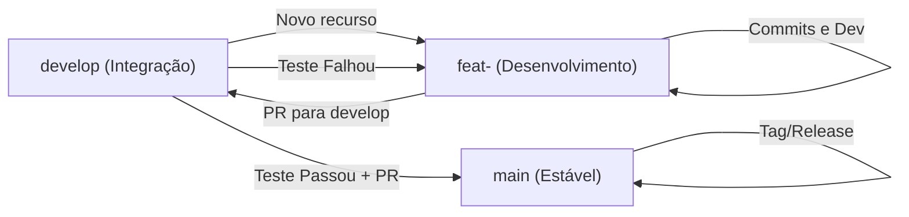

# 🚀 Guia de Padronização: Workflow e Releases

Este documento estabelece o fluxo de trabalho e as diretrizes de versionamento para a equipe de desenvolvimento da **BRAIN**. O objetivo é garantir um ambiente de colaboração organizado, uma `main` sempre estável e releases rastreáveis.

> [!IMPORTANT]
> **AUTORIDADE DE RELEASE E BACKUP:** 
> O versionamento oficial de **Releases** na `main` e a execução de procedimentos de **Backup** do ambiente/banco de dados são de responsabilidade **EXCLUSIVA do Tech Lead**. Outros desenvolvedores não estão autorizados a criar tags de versão ou realizar backups sem supervisão direta.

---

## 🌊 1. Gitflow (Fluxo de Trabalho)

O nosso fluxo baseia-se na separação estrita entre desenvolvimento, integração e estabilidade.



### Branches e Papéis
*   **`main`**: Contém apenas código testado, funcional e pronto para produção. **Nunca** faça commits diretos na `main`.
*   **`develop`**: Ponto de encontro de todas as funcionalidades finalizadas. Nela ocorrem os testes de integração.
*   **`feat-<nome>`**: Branches temporárias para o desenvolvimento de novas features.

### O Ciclo de Vida de uma Task
1.  Parta da `develop` para criar sua branch `feat-<nome>`.
2.  Desenvolva e realize todos os commits necessários na sua branch.
3.  Quando concluir, abra um **Pull Request (PR)** para a `develop`.
4.  Após a validação na `develop`, o código segue para a `main` via um novo PR de atualização de versão.

> [!NOTE]
> **POLÍTICA DE HOTFIX:** Não utilizamos branches de hotfix. Se um erro for encontrado na `develop` ou `main`, o desenvolvedor deve retornar à sua branch `feat-`, realizar a correção e abrir um novo PR.

### 🛡️ Regras de Pull Request (Revisão Obrigatória)
Para garantir a qualidade, todo PR (seja para `develop` ou para `main`) deve seguir estas regras de revisão:
*   **Reviewers Obrigatórios:** O autor do PR deve obrigatoriamente marcar como revisores:
    1.  O **Dev Responsável pela Integração**.
    2.  O **Tech Lead**.
*   **Critério de Aprovação:** Um Pull Request só será considerado aprovado e apto para o merge após receber o "Approve" de **AMBOS** os revisores mencionados acima.
*   **Validação:** Testes locais e conformidade com os padrões de commit são pré-requisitos para a revisão.

---

## 🏷️ 2. Versionamento Semântico (SemVer)

Adotamos o padrão `vMAJOR.MINOR.PATCH`.

*   **MAJOR** (v**1**.0.0): Mudanças que quebram a compatibilidade/API anterior.
*   **MINOR** (v0.**1**.0): Inclusão de novas funcionalidades (features) de forma retrocompatível.
*   **PATCH** (v0.0.**1**): Correção de bugs.

### Conventional Commits
Para facilitar o rastreamento, utilize prefixos nos seus commits:
| Prefixo | Impacto SemVer | Descrição |
| :--- | :--- | :--- |
| `feat:` | **MINOR** | Nova funcionalidade. |
| `fix:` | **PATCH** | Correção de erro. |
| `docs:` | Nenhum | Alteração apenas em documentação. |
| `refactor:` | Nenhum | Melhoria de código que não altera comportamento. |
| `perf:` | **PATCH** | Melhoria de performance. |
| `BREAKING CHANGE:` | **MAJOR** | Mudança estrutural (deve ser no corpo do commit). |

---

## 📦 3. Como Criar uma Release (Passo a Passo)

### Via Interface Web do GitHub (Recomendado)
1.  No repositório, clique em **Releases** (na barra lateral direita).
2.  Clique no botão **Draft a new release**.
3.  Clique em **Choose a tag**:
    *   Digite a nova versão (ex: `v1.2.0`).
    *   Certifique-se de que o "Target" seja a branch `main`.
4.  Em **Release Title**, use o nome da versão (ex: `v1.2.0 - VRAM & CUDA Fix`).
5.  Clique em **Generate release notes**:
    *   Isso listará automaticamente todos os PRs e commits desde a última versão com base no nosso padrão.
6.  Revise as notas e clique em **Publish release**.

### Via Terminal - Controle de Versionamento para Tech Lead (CLI)
Caso prefira o controle total via linha de comando:
```bash
# 1. Vá para a main e puxe as novidades
git checkout main
git pull origin main

# 2. Crie a tag anotada
git tag -a v1.2.0 -m "Release v1.2.0 - Otimizações de Memória"

# 3. Suba a tag para o servidor
git push origin v1.2.0
```

---

## 💡 4. Dicas de Ouro
*   **PRs Pequenos:** Evite PRs de 50 arquivos. PRs pequenos são testados mais rápido e têm menos erros.
*   **Descrições de Commit:** Use o imperativo (ex: `feat: add whisper cpu support` em vez de `feat: added whisper...`).
*   **Testes na Develop:** Nunca promova código para a `main` se houver falhas críticas na `develop`. Reverter a `main` é muito mais custoso e arriscado.
*   **Sincronização:** Mantenha sua branch sempre atualizada com a `develop`.
*   **Status de Deploy:** Atualmente, a aplicação roda estritamente de forma **Local**. Não há deploy automatizado para nuvem (Vercel/Render) configurado.

---

## 🛠️ 5. Guia Prático: Do Desenvolvimento ao PR

Este guia rápido ajuda você a seguir o Gitflow do **BRAIN** sem erros.

### 1. Criando sua Branch - Para Devs
Sempre parta da `develop` para novas funcionalidades:
```bash
git checkout develop
git pull origin develop       # Garanta que está atualizado
git checkout -b feat-nome-da-task
```

### 2. Padronizando seus Commits
Siga fielmente os prefixos. Exemplos reais:

| Tipo | Exemplo de Comando | O que mudou? |
| :--- | :--- | :--- |
| **Feature** | `git commit -m "feat: add support for audio streaming"` | Novo recurso adicionado. |
| **Fix** | `git commit -m "fix: resolve memory leak in whisper loop"` | Correção de bug existente. |
| **Docs** | `git commit -m "docs: update API endpoints in README"` | Alteração apenas em documentação. |
| **Refactor** | `git commit -m "refactor: optimize database query logic"` | Melhoria de código sem mudar comportamento. |

### 3. Mantendo-se Atualizado (Sincronização)
Se a `develop` mudou enquanto você trabalhava, atualize sua branch para evitar conflitos no PR:
```bash
git fetch origin
git merge origin/develop
# Resolva conflitos se houver, salve e commite.
```

### 4. Abrindo o Pull Request para Code Review
1. Faça o push da sua branch: `git push origin feat-nome-da-task`.
2. No GitHub, clique em **"Compare & pull request"**.
3. **Reviewers:** Marque obrigatoriamente o **Tech Lead** e o **Dev Integrador**.
4. **Base:** Certifique-se de que a base é `develop` (para novos recursos) ou `main` (apenas se for release guiada).

### ✅ Checklist PR-Ready (Antes de avisar o time)
- [ ] O código roda localmente sem erros?
- [ ] Os commits seguem o padrão `prefixo: descrição`?
- [ ] Removi `print()` de debug e comentários desnecessários?
- [ ] Minha branch está sincronizada com a `develop` mais recente?
